# Architecture Diagrams — AI-Powered Personal Finance Assistant

> **KPMG Submission Reference** · Generated: June 2026  
> Full-stack AI system: LangGraph agent · Hybrid RAG with reranking · Financial health scoring · Anomaly detection · FCA compliance · UK fintech knowledge base · End-to-end evaluation framework

---

## 1. System Architecture Overview

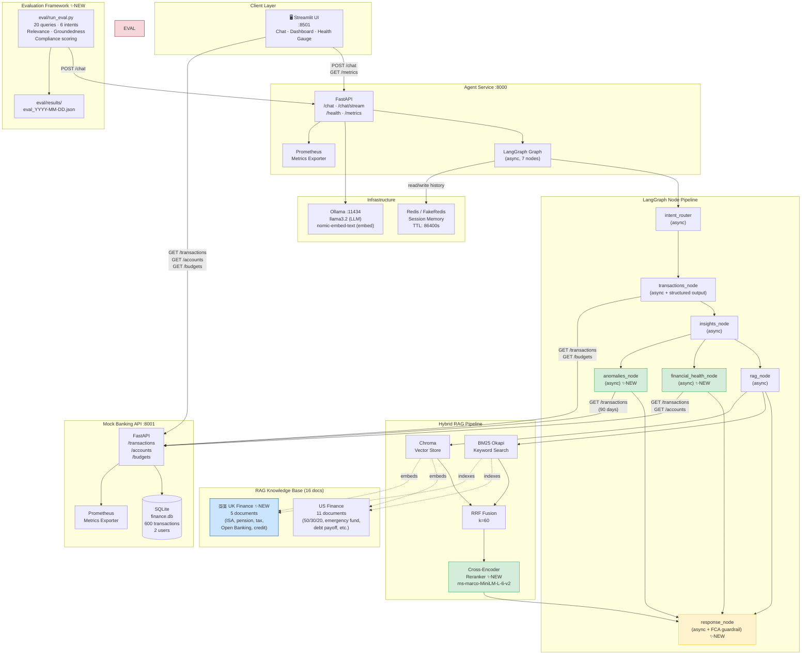

---

## 2. LangGraph Full Node Flow

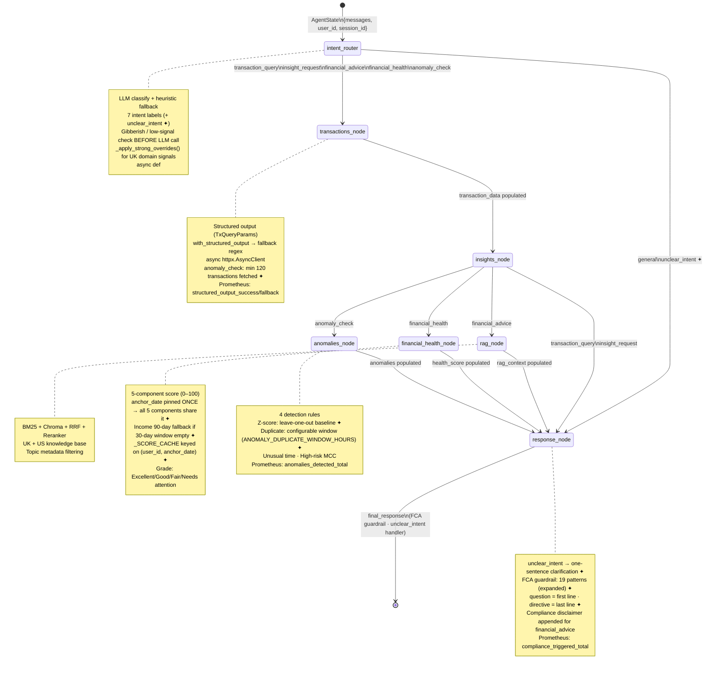

> **✦** = changed in Bug Fix Round 2 (June 2026)

---

## 3. Hybrid RAG Pipeline with Cross-Encoder Reranker

```mermaid
flowchart LR
    Q["User Query"] --> EMB["Embed Query\nnomic-embed-text"]
    Q --> TOK["Tokenize\nWhitespace + punct"]

    EMB --> CHROMA["Chroma\nVector Search\n(top k×3 candidates)\ncosine similarity"]
    TOK --> BM25["BM25 Okapi\nKeyword Search\n(top k×3 candidates)"]

    subgraph TopicFilter["Topic Metadata Filter"]
        TF["Intent → Topic Whitelist\n16 topics: ISA, pension, tax,\nbudget, emergency_fund..."]
    end

    CHROMA --> TF
    BM25 --> TF
    TF --> RRF

    subgraph RRFBlock["Reciprocal Rank Fusion (k=60)"]
        RRF["score(d) = Σ 1/(k + rank_i)\nFusion across both ranked lists"]
    end

    RRF --> CANDS["Fused Candidates\n(top k×2)"]

    subgraph Reranker["✨ Cross-Encoder Reranker (NEW)"]
        CE["cross-encoder/ms-marco-MiniLM-L-6-v2\nScore (query, chunk_text) pairs\nSingle forward pass per pair"]
        THRESH["Score Threshold Filter\nmin_score=0.20"]
        TOPK["Top-K Selection\nk=4 (configurable)"]
    end

    CANDS --> CE
    CE --> THRESH
    THRESH --> TOPK

    TOPK --> OUT["Retrieved Chunks\n[{content, source, topic, score, reranker_score}]"]

    subgraph HealthEndpoint["Health Endpoint"]
        HE["/health\nreranker_enabled: bool\nreranker_model: str"]
    end

    OUT --> HE

    style Reranker fill:#d4edda,stroke:#28a745
    style RRFBlock fill:#e2d9f3,stroke:#6f42c1
```

---

## 4. Financial Health Score — Component Architecture

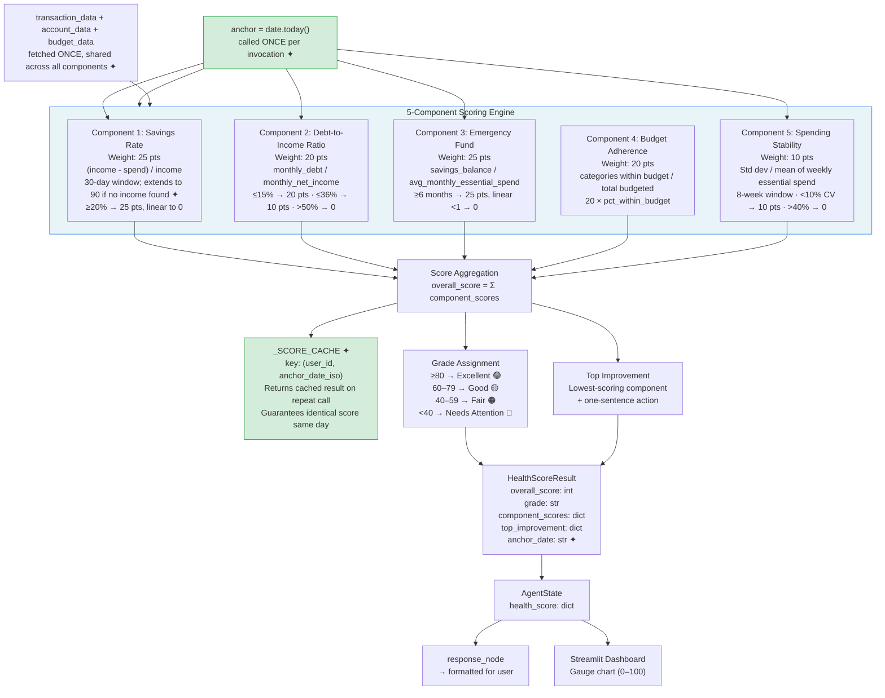

> **✦** = Bug Fix Round 2: anchor_date pinned once eliminates non-determinism from independent `datetime.now()` calls in each component.

---

## 5. Anomaly Detection Pipeline

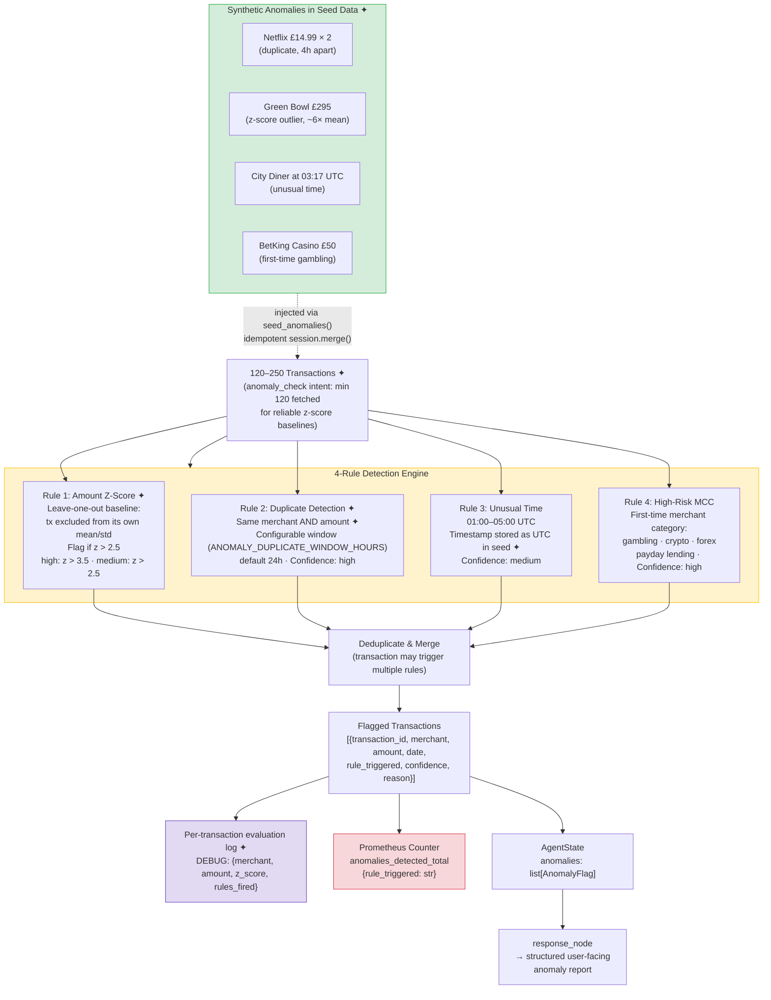

> **✦** = Bug Fix Round 2: leave-one-out z-score prevents self-contamination; synthetic anomalies ensure detection always fires on test data.

---

## 6. FCA Compliance Guardrail

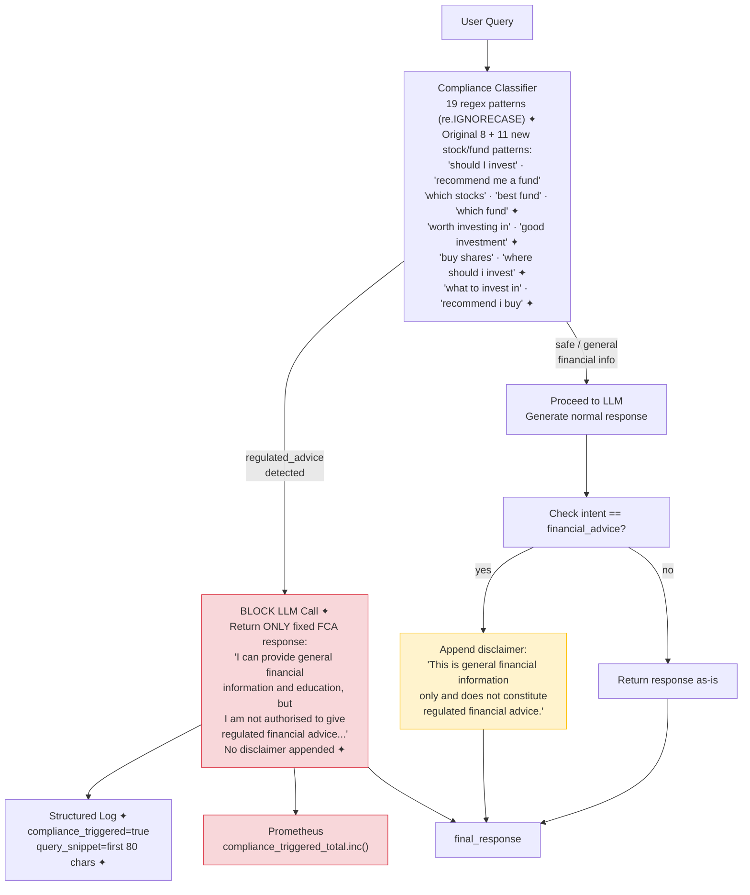

> **✦** = Bug Fix Round 2: 11 additional patterns added; guardrail returns **only** the fixed message with zero LLM calls; `query_snippet` field added to compliance log.

---

## 7. Structured LLM Output — Two-Path Architecture

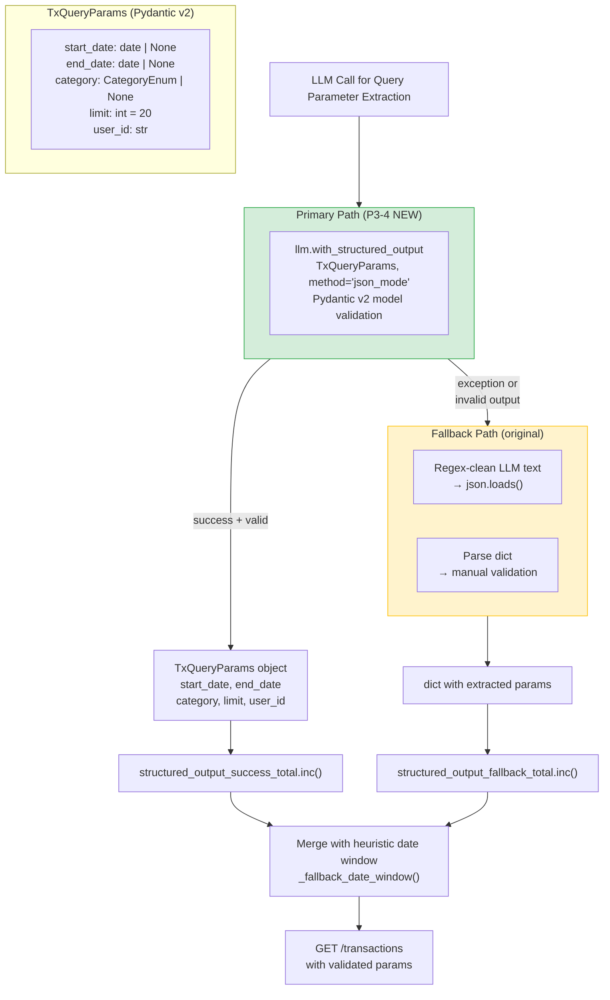

---

## 8. Evaluation Framework

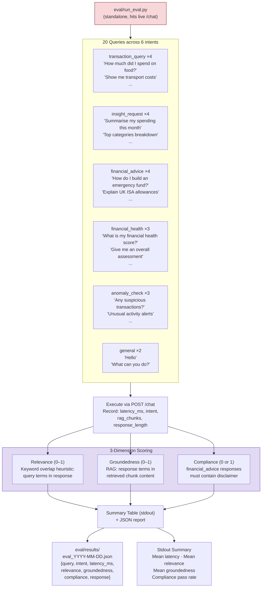

---

## 9. Request Lifecycle — Sequence Diagram

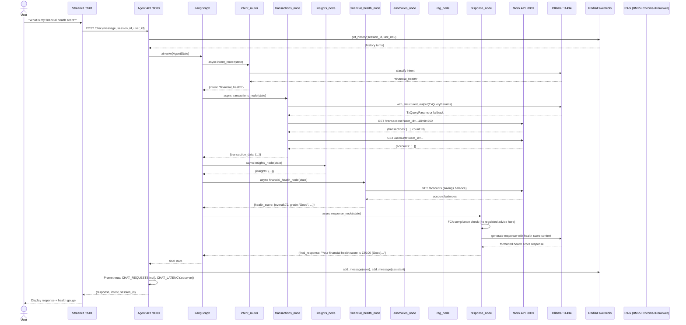

---

## 10. Data Model (ER Diagram)

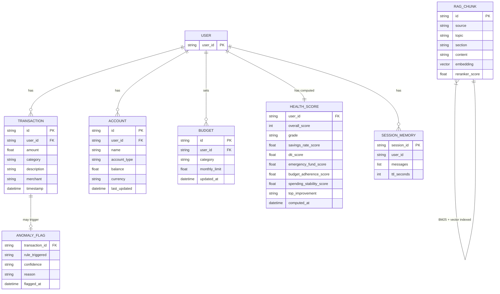

---

## 11. UK Fintech Knowledge Base — Document Taxonomy

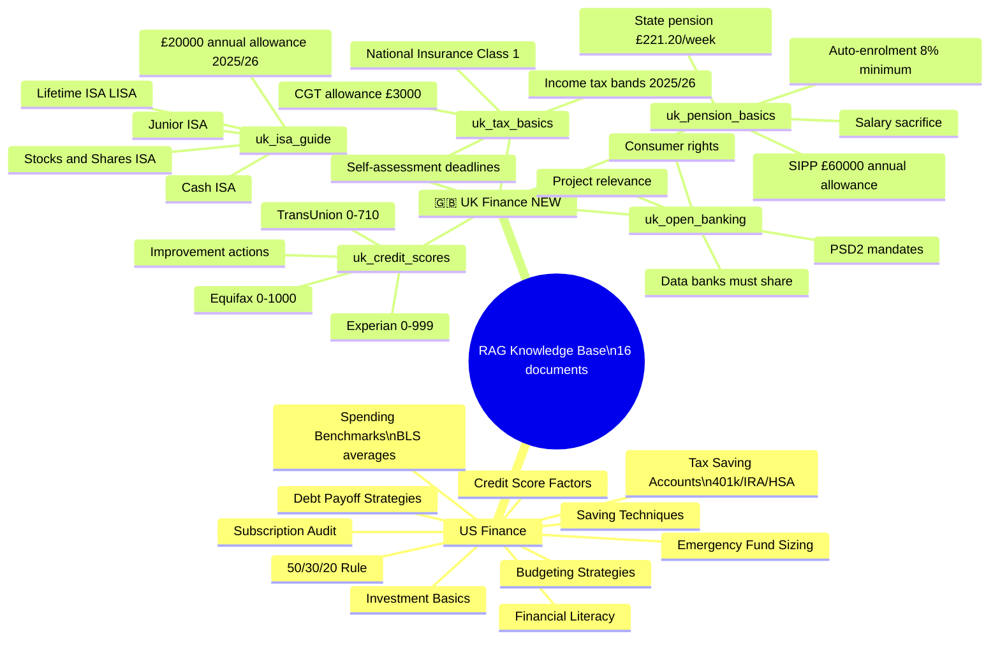

---

## 12. Prometheus Metrics Map

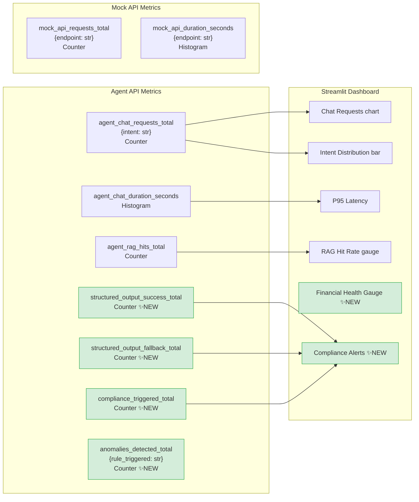

---

## 13. Deployment Topology

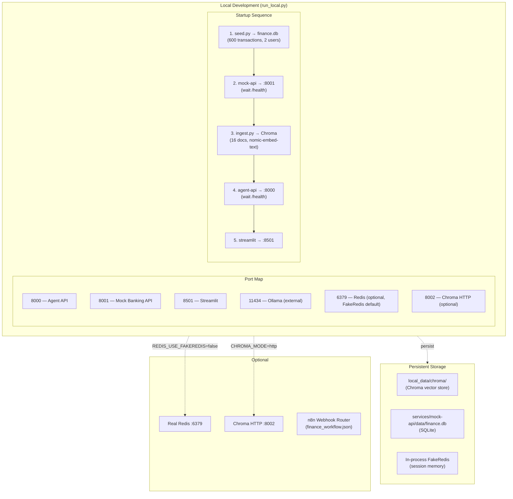

---

## Summary Table — What's New

| Feature | Category | Prometheus Counter | Impact |
|---|---|---|---|
| Cross-encoder reranker | ML Engineering | — | Better RAG precision |
| Structured LLM output | ML Engineering | `structured_output_success_total` `structured_output_fallback_total` | Measurable reliability |
| Async LangGraph nodes | Backend | — | True async, `ainvoke` |
| Financial health score | Fintech Domain | — | Novel scoring product |
| Anomaly detection | Fintech Domain | `anomalies_detected_total{rule}` | Risk management |
| FCA compliance guardrail | Regulatory | `compliance_triggered_total` | UK regulatory awareness |
| Evaluation framework | ML Ops | — | Measured system quality |
| UK RAG knowledge base | Domain Knowledge | — | UK fintech relevance |

---

## Bug Fix Round 2 — Diagrams Delta (June 2026)

### Diagram 2 changes: `unclear_intent` graph path

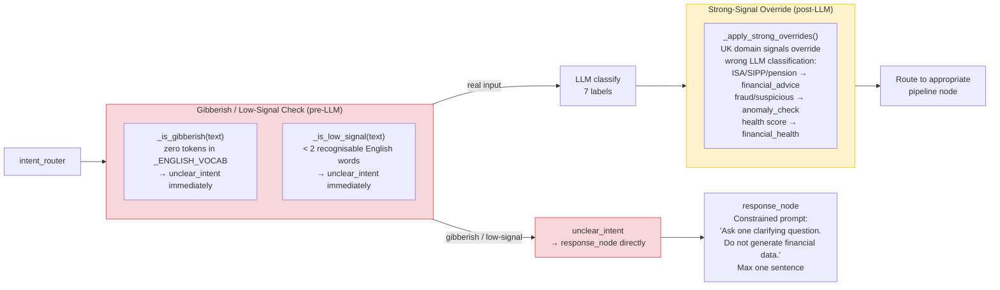

### Bug Fix Round 2 — Changes at a glance

| Bug | Diagram affected | Change |
|---|---|---|
| BF2-1 Stale state | — | `_assert_clean_state()` guard; no diagram change |
| BF2-2 Question lost in prompt | — | Prompt structure (code change only) |
| BF2-3 Missing keywords | Diagram 2 | `_apply_strong_overrides()` + expanded keyword lists |
| BF2-4 Non-deterministic score | Diagram 4 | `anchor_date` pinned once; `_SCORE_CACHE` |
| BF2-5 Anomaly detection | Diagram 5 | Leave-one-out z-score; synthetic anomaly seed |
| BF2-6 FCA guardrail | Diagram 6 | 11 new patterns; ONLY fixed message returned |
| BF2-7 Garbage input | Diagram 2 + new | Gibberish guard; `unclear_intent` path |
