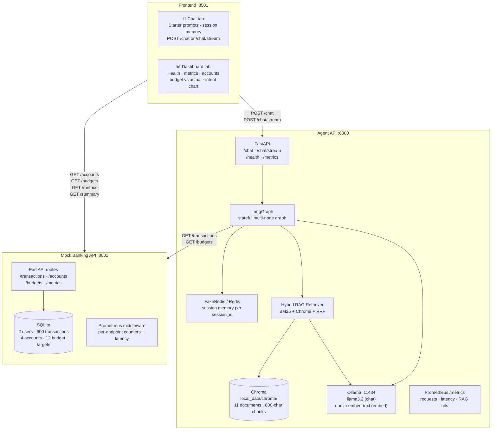
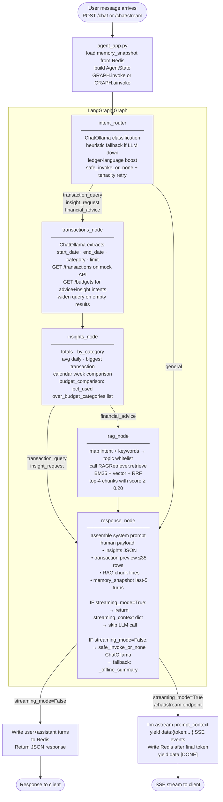
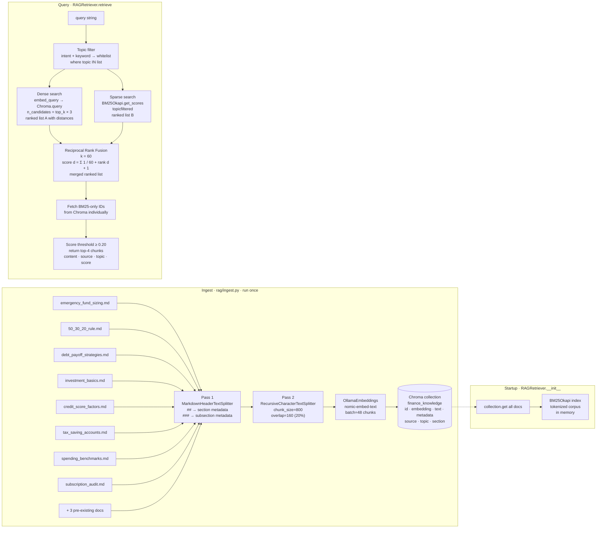
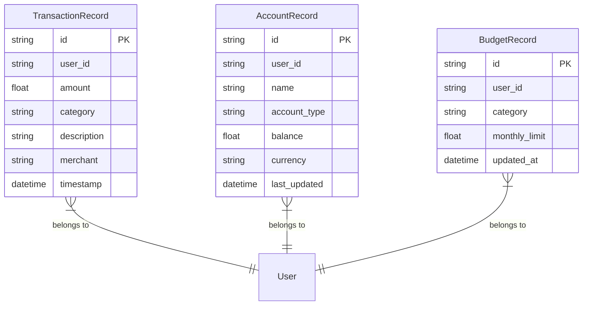
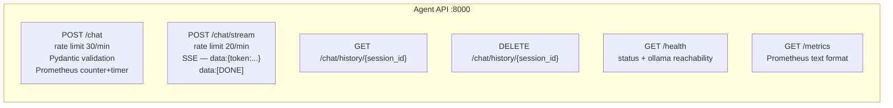
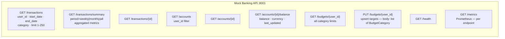
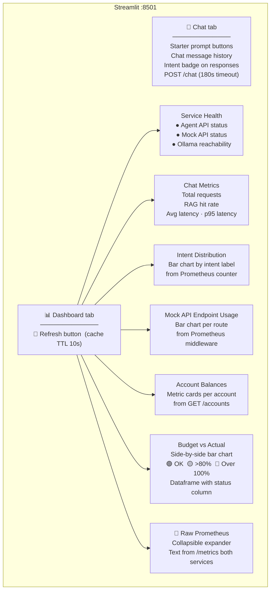
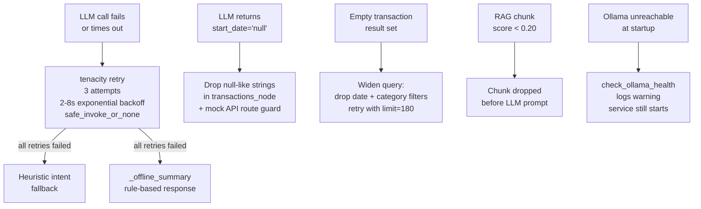

# AI-Powered Personal Finance Assistant — Project Overview

> Full audit and improvement history: `BACKEND_AUDIT_ROADMAP.md`

---

## 1. High-level architecture



---

## 2. LangGraph agent — full workflow



---

## 3. RAG pipeline — ingest and retrieval



---

## 4. Mock Banking API — data model



**Seed data:** 2 users (`user_001`, `user_002`) · 300 transactions each · 180-day window · 50+ merchants · 7 categories · 2 accounts per user · 6 budget targets per user

---

## 5. API endpoints

### Agent API  `http://127.0.0.1:8000`



### Mock Banking API  `http://127.0.0.1:8001`



---

## 6. Streamlit dashboard



---

## 7. Resilience and reliability



---

## 8. Prometheus observability

### Agent API metrics

| Metric | Type | Label | What it measures |
|---|---|---|---|
| `agent_chat_requests_total` | Counter | `intent` | Requests per classified intent |
| `agent_chat_duration_seconds` | Histogram | — | End-to-end latency (p50, p95, p99) |
| `agent_rag_hits_total` | Counter | — | RAG queries returning ≥1 chunk |

### Mock API metrics (HTTP middleware)

| Metric | Type | Label | What it measures |
|---|---|---|---|
| `mock_api_requests_total` | Counter | `endpoint` | Hits per route prefix |
| `mock_api_duration_seconds` | Histogram | `endpoint` | Latency per route |

View: `http://localhost:8000/metrics` · `http://localhost:8001/metrics`

Optional Grafana queries:
```promql
rate(agent_chat_requests_total[5m])
histogram_quantile(0.95, agent_chat_duration_seconds_bucket)
agent_rag_hits_total / ignoring(intent) agent_chat_requests_total
```

---

## 9. Configuration reference

| Variable | Default | Description |
|---|---|---|
| `OLLAMA_BASE_URL` | `http://127.0.0.1:11434` | Ollama server |
| `OLLAMA_MODEL` | `llama3.2` | Chat LLM |
| `OLLAMA_EMBED_MODEL` | `nomic-embed-text` | Embedding model |
| `OLLAMA_TIMEOUT_SECONDS` | `120` | Per-request LLM timeout |
| `BANKING_API_URL` | `http://127.0.0.1:8001` | Mock banking API |
| `AGENT_API_URL` | `http://127.0.0.1:8000` | Agent API (used by Streamlit) |
| `CHROMA_MODE` | `persist` | `persist` (embedded) or `http` |
| `CHROMA_COLLECTION` | `finance_knowledge` | Chroma collection name |
| `REDIS_USE_FAKEREDIS` | `true` | In-process fake Redis |
| `REDIS_URL` | `redis://127.0.0.1:6379` | Real Redis (if fakeredis=false) |
| `DEFAULT_USER_ID` | `user_001` | Default user for seeded data |
| `LOG_LEVEL` | `INFO` | Logging level |

---

## 10. Technology stack

| Technology | Role |
|---|---|
| **Python 3.11–3.13** | All services |
| **FastAPI + uvicorn** | Agent API (8000) + Mock Banking API (8001) |
| **LangGraph** | Multi-node stateful agent graph with conditional routing |
| **LangChain** | `ChatOllama`, `OllamaEmbeddings`, `MarkdownHeaderTextSplitter` |
| **Ollama** | Local LLM (`llama3.2`) + embeddings (`nomic-embed-text`) |
| **Chroma** | Persistent vector store (embedded SQLite) |
| **rank-bm25** | `BM25Okapi` sparse index for hybrid retrieval |
| **tenacity** | Retry with exponential backoff on all LLM calls |
| **slowapi** | Rate limiting (30/min chat, 20/min stream) |
| **prometheus-client** | `/metrics` endpoints + HTTP middleware on both services |
| **Redis / FakeRedis** | Session-scoped conversation memory |
| **SQLAlchemy + SQLite** | Mock bank persistence (transactions, accounts, budgets) |
| **Faker** | Deterministic synthetic transaction data |
| **Streamlit** | Chat UI + live observability dashboard |
| **httpx** | HTTP client (agent → mock API) |
| **pandas** | Dashboard data processing |
| **pydantic v2** | Request/response validation schemas |
| **python-dotenv** | `.env` config loading |

---

## 11. Running the project

```bash
cd "finance-assistant/"

python -m venv .venv
source .venv/Scripts/activate      # Git Bash on Windows

pip install --upgrade pip
pip install -r requirements-local.txt

python run_local.py                # Full start (seed + ingest + all services)
python run_local.py --skip-ingest  # Fast restart (skip RAG re-embed)
python run_local.py --free-ports   # Windows: kill stale port occupants first
```

| URL | Service |
|---|---|
| http://127.0.0.1:8501 | Streamlit — Chat + Dashboard |
| http://127.0.0.1:8000/docs | Agent API Swagger |
| http://127.0.0.1:8001/docs | Mock Banking API Swagger |
| http://127.0.0.1:8000/metrics | Agent Prometheus |
| http://127.0.0.1:8001/metrics | Mock API Prometheus |

---

## 12. Out of scope (by design)

- No real bank connectors (PSD2 / Open Banking)
- No production auth (API keys, OAuth)
- Mock data is finite — aggregates reflect only the seeded slice
- Local LLMs can still hallucinate; the insights-first prompt design minimises but does not eliminate numeric errors
