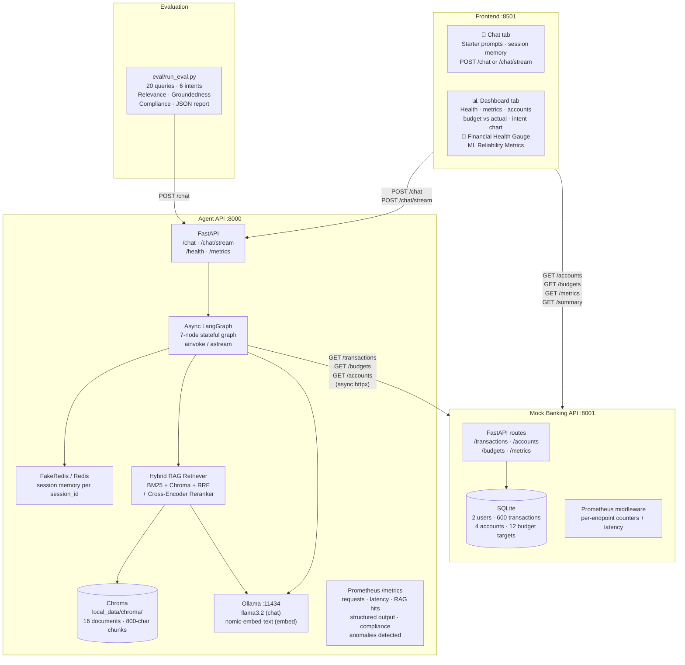
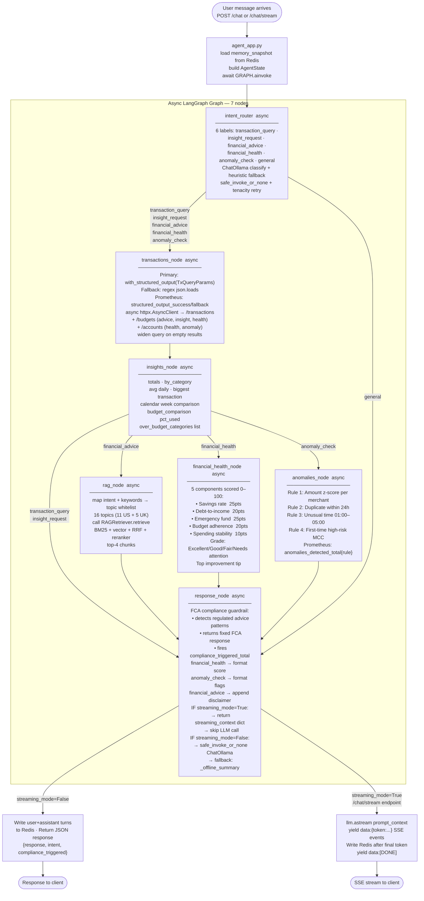
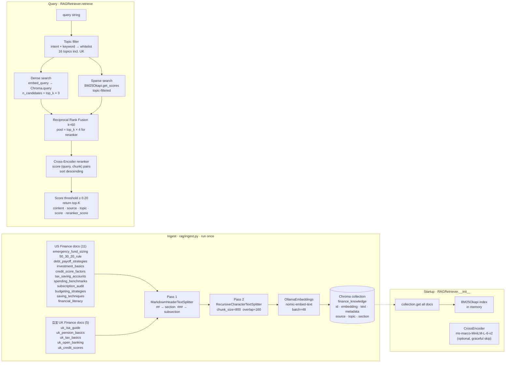
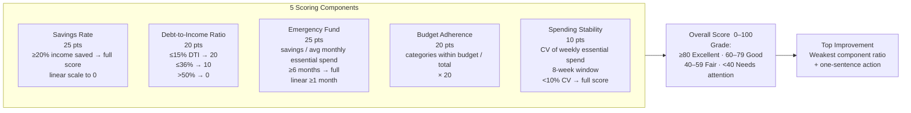
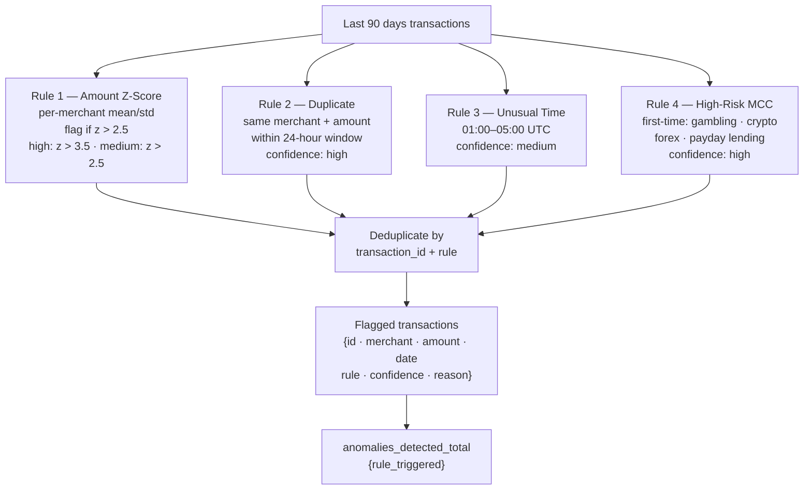
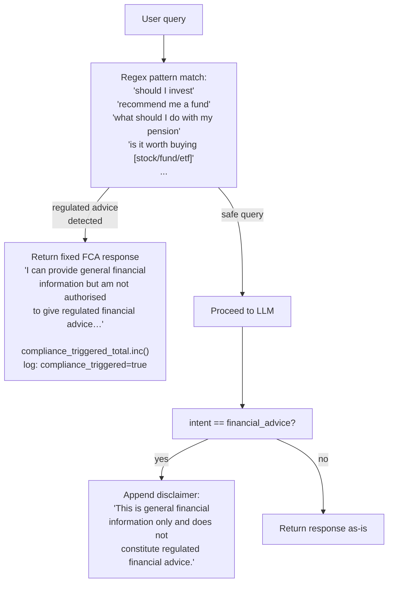
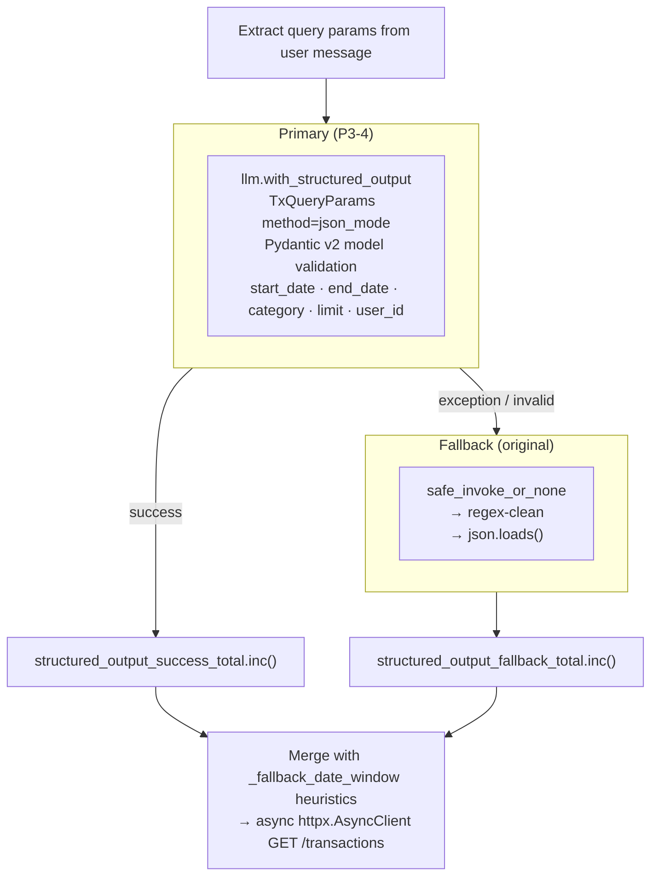
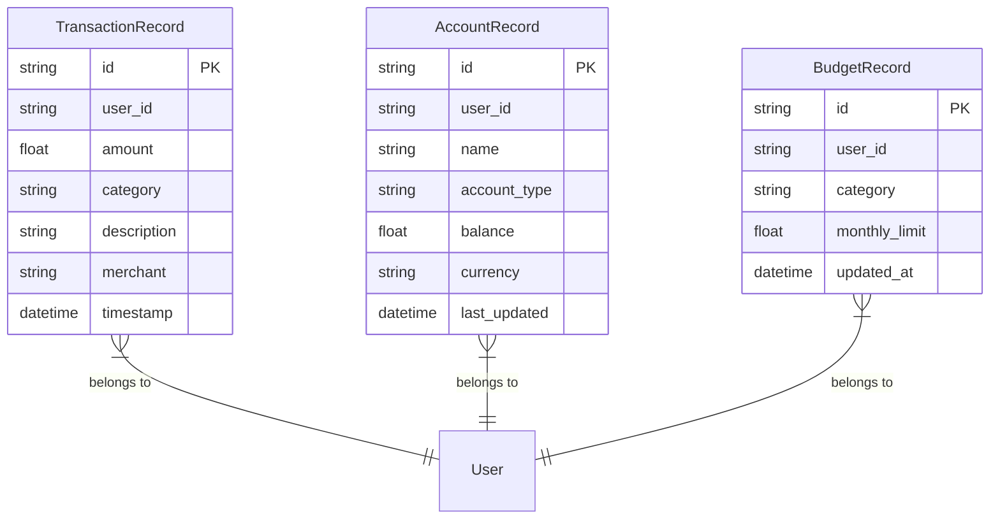
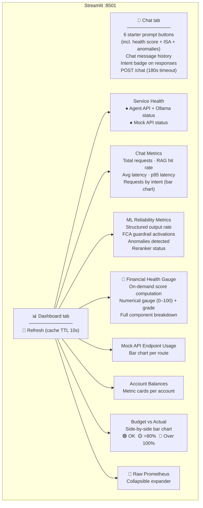
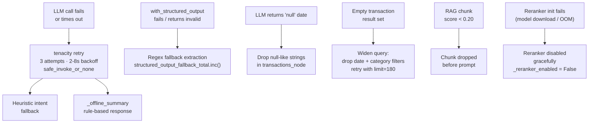

# AI-Powered Personal Finance Assistant — Project Overview

> Full audit and improvement history: `BACKEND_AUDIT_ROADMAP.md`  
> Mermaid architecture diagrams: `ARCHITECTURE_DIAGRAMS.md`

---

## 1. High-level architecture



---

## 2. LangGraph agent — full workflow



---

## 3. RAG pipeline — ingest and retrieval



---

## 4. Financial Health Score — component model



---

## 5. Anomaly Detection — 4-rule engine



---

## 6. FCA Compliance Guardrail



---

## 7. Structured LLM output — two-path extraction



---

## 8. Mock Banking API — data model



**Seed data:** 2 users (`user_001`, `user_002`) · 300 transactions each · 180-day window · 50+ merchants · 7 categories · 2 accounts per user · 6 budget targets per user

---

## 9. API endpoints

### Agent API  `http://127.0.0.1:8000`

| Method | Path | Rate limit | Description |
|---|---|---|---|
| `POST` | `/chat` | 30/min | Async chat; returns `{response, intent, session_id, compliance_triggered}` |
| `POST` | `/chat/stream` | 20/min | SSE streaming; emits `data: {"token": "..."}` then `data: [DONE]` |
| `GET` | `/chat/history/{session_id}` | — | Full Redis conversation history |
| `DELETE` | `/chat/history/{session_id}` | — | Clear session |
| `GET` | `/health` | — | Ollama reachability + reranker status (`reranker_enabled`, `reranker_model`) |
| `GET` | `/metrics` | — | Prometheus text format |

### Mock Banking API  `http://127.0.0.1:8001`

| Method | Path | Description |
|---|---|---|
| `GET` | `/transactions` | Filter by user_id, start/end date, category, limit 1–250 |
| `GET` | `/transactions/summary` | `period=weekly\|monthly\|all` |
| `GET` | `/transactions/{id}` | Single transaction |
| `GET` | `/accounts` | List accounts by user_id |
| `GET` | `/accounts/{id}/balance` | Balance payload |
| `GET` | `/budgets/{user_id}` | All category budget limits |
| `PUT` | `/budgets/{user_id}` | Upsert budget categories |
| `GET` | `/health` | — |
| `GET` | `/metrics` | Prometheus per-endpoint |

---

## 10. Streamlit dashboard



---

## 11. Prometheus metrics — full reference

### Agent API

| Metric | Type | Labels | What it measures |
|---|---|---|---|
| `agent_chat_requests_total` | Counter | `intent` | Requests per classified intent |
| `agent_chat_duration_seconds` | Histogram | — | End-to-end latency |
| `agent_rag_hits_total` | Counter | — | RAG queries returning ≥1 chunk |
| `structured_output_success_total` | Counter | — | Successful `TxQueryParams` structured output extractions |
| `structured_output_fallback_total` | Counter | — | Fallbacks to regex extraction |
| `compliance_triggered_total` | Counter | — | FCA regulated-advice guardrail activations |
| `anomalies_detected_total` | Counter | `rule_triggered` | Flagged transactions per detection rule |

### Mock API (HTTP middleware)

| Metric | Type | Label | What it measures |
|---|---|---|---|
| `mock_api_requests_total` | Counter | `endpoint` | Hits per route prefix |
| `mock_api_duration_seconds` | Histogram | `endpoint` | Latency per route |

Example Prometheus queries:
```promql
rate(agent_chat_requests_total[5m])
histogram_quantile(0.95, rate(agent_chat_duration_seconds_bucket[5m]))
structured_output_success_total / (structured_output_success_total + structured_output_fallback_total)
rate(anomalies_detected_total[1h])
```

---

## 12. UK RAG Knowledge Base

Five UK-specific documents added to `services/agent/rag/documents/`:

| File | Topic tag | Content |
|---|---|---|
| `uk_isa_guide.md` | `uk_isa_guide` | Cash ISA, Stocks & Shares ISA, LISA (25% bonus), JISA, £20,000 annual allowance 2025/26 |
| `uk_pension_basics.md` | `uk_pension_basics` | Auto-enrolment 8%, SIPP £60k allowance, State Pension £221.20/wk, salary sacrifice |
| `uk_tax_basics.md` | `uk_tax_basics` | Income tax bands 2025/26, NI Class 1, CGT £3,000 allowance, Self Assessment deadlines |
| `uk_open_banking.md` | `uk_open_banking` | PSD2 mandates, consumer data rights, revocation, how this project relates |
| `uk_credit_scores.md` | `uk_credit_scores` | Experian/Equifax/TransUnion scales, factors, overdraft impact, improvement actions |

All documents use `##` and `###` headers for optimal chunk splitting with `MarkdownHeaderTextSplitter`.

---

## 13. Evaluation framework

```
eval/
├── run_eval.py          # Standalone evaluation script
└── results/
    └── eval_YYYY-MM-DD.json
```

`run_eval.py` runs 20 representative queries against the live `/chat` endpoint covering all 6 intent types. Scores each response on:

| Dimension | Method | Scale |
|---|---|---|
| **Relevance** | Keyword overlap between query and response | 0–1 |
| **Groundedness** | RAG chunk terms appearing in response | 0–1 |
| **Compliance** | `financial_advice` responses contain the FCA disclaimer | 0 or 1 |

```bash
python eval/run_eval.py [--url http://127.0.0.1:8000] [--user-id user_001]
```

---

## 14. Resilience and reliability



---

## 15. Configuration reference

| Variable | Default | Description |
|---|---|---|
| `OLLAMA_BASE_URL` | `http://127.0.0.1:11434` | Ollama server |
| `OLLAMA_MODEL` | `llama3.2` | Chat LLM |
| `OLLAMA_EMBED_MODEL` | `nomic-embed-text` | Embedding model |
| `BANKING_API_URL` | `http://127.0.0.1:8001` | Mock banking API |
| `AGENT_API_URL` | `http://127.0.0.1:8000` | Agent API (used by Streamlit) |
| `CHROMA_MODE` | `persist` | `persist` (embedded SQLite) or `http` |
| `CHROMA_COLLECTION` | `finance_knowledge` | Chroma collection name |
| `REDIS_USE_FAKEREDIS` | `true` | In-process fake Redis |
| `REDIS_URL` | `redis://127.0.0.1:6379` | Real Redis (if fakeredis=false) |
| `DEFAULT_USER_ID` | `user_001` | Default user for seeded data |
| `LOG_LEVEL` | `INFO` | Logging level |
| `RERANKER_ENABLED` | `true` | Enable cross-encoder reranker (skipped if sentence-transformers absent) |
| `RERANKER_MODEL` | `cross-encoder/ms-marco-MiniLM-L-6-v2` | Hugging Face reranker model |
| `HTTP_TIMEOUT_SECONDS` | `30` | Timeout for agent → mock API requests |

---

## 16. Technology stack

| Technology | Version | Role |
|---|---|---|
| **Python** | 3.11–3.13 | All services |
| **FastAPI + uvicorn** | ≥0.115 | Agent API (:8000) + Mock Banking API (:8001) |
| **LangGraph** | ≥1.1 | Async 7-node stateful agent graph |
| **LangChain** | ≥1.2 | `ChatOllama`, `OllamaEmbeddings`, `MarkdownHeaderTextSplitter` |
| **Ollama** | — | Local LLM (`llama3.2`) + embeddings (`nomic-embed-text`) |
| **Chroma** | ≥1.5.9 | Persistent vector store |
| **rank-bm25** | ≥0.2.2 | `BM25Okapi` sparse index for hybrid retrieval |
| **sentence-transformers** | ≥3.0 (optional) | Cross-encoder reranker (`ms-marco-MiniLM-L-6-v2`) |
| **tenacity** | ≥8.2 | Retry with exponential backoff on all LLM calls |
| **slowapi** | ≥0.1.9 | Rate limiting (30/min chat, 20/min stream) |
| **prometheus-client** | ≥0.20 | `/metrics` on both services; 7 agent counters/histograms |
| **httpx** | ≥0.27 | Async HTTP client (agent → mock API) |
| **Redis / FakeRedis** | ≥5.0 | Session-scoped conversation memory |
| **SQLAlchemy + SQLite** | ≥2.0 | Mock bank persistence |
| **Faker** | ≥24.0 | Deterministic synthetic transaction data |
| **Streamlit** | ≥1.41 | Chat UI + live observability + health score gauge |
| **pandas** | ≥2.0 | Dashboard data processing |
| **pydantic v2** | ≥2.10 | Request/response validation; `TxQueryParams` structured output |
| **pytest** | ≥8.0 | Unit tests (4 test modules, 40+ tests) |

---

## 17. Out of scope (by design)

- No real bank connectors (PSD2 / Open Banking) — mock API mirrors the data shape
- No production auth (API keys, OAuth, mTLS)
- Mock data is finite — aggregates reflect only the seeded 180-day slice
- Local LLMs can hallucinate; insights-first prompt design minimises but does not eliminate numeric errors
- FCA compliance guardrail is pattern-based, not legally complete — demonstrates regulatory awareness, not legal authorisation

---

## 18. Bug Fix Round 2 — June 2026

Seven engineering bugs were identified through structured live testing (20 representative queries) and fixed in full, each with a dedicated regression test. All 59 tests in `services/agent/tests/test_bug_fixes.py` pass.

### BF2-1 — Stale state between requests

**Symptom:** Different queries returned identical responses in the same session.

The root cause was not a mutable default in `AgentState` (which is a TypedDict with no defaults), but the absence of an explicit invariant check. Fixed by adding `_assert_clean_state()` — called before every `GRAPH.ainvoke()` — which raises `AssertionError` immediately if any result field (`transaction_data`, `insights`, `rag_context`, `anomalies`, `health_score`) is non-None at graph entry. A defensive `list(history)` copy was also added so the memory snapshot is never a shared reference.

### BF2-2 — User question lost in LLM prompt

**Symptom:** The LLM replied "you didn't ask a specific question" for specific queries like "How much did I spend on dining last month?".

`response_node` was assembling `human_payload` with a rules block first, then the question buried after the JSON context. The LLM pattern-matched to the context and lost the question. Fixed by restructuring the payload:

```
User question: {question}               ← FIRST line
[blank line]
AUTHORITATIVE_NUMBERS_RULE: ...
INSIGHT JSON: ...
TRANSACTION PREVIEW JSON: ...
RAG CONTEXT: ...

Answer the user's question directly and specifically. Do not summarise the data unless asked.
                                         ← LAST line
```

### BF2-3 — Intent router missing UK finance keywords

**Symptom:** "Cash ISA vs Stocks and Shares ISA" routed to `transaction_query`. "Spending summary" routed to `financial_health`.

Two separate causes: the heuristic keyword list lacked UK product terms, and heuristic upgrades only fired when the LLM returned `"general"` — a wrong LLM classification (e.g. `"transaction_query"`) could not be corrected. Fixed by:

1. Expanding all keyword lists with full UK finance vocabulary (ISA, LISA, JISA, SIPP, pension, ETF, compound interest, open banking, etc. for `financial_advice`; compare, breakdown, overspending, etc. for `insight_request`)
2. Adding `_apply_strong_overrides()` — unconditionally corrects the LLM label when a strong domain signal is detected in the message, regardless of what the LLM returned

### BF2-4 — Financial health score non-deterministic

**Symptom:** Same user, same session: score was 48 on one call, 38 on the next.

Each of the five component functions was calling `datetime.now(timezone.utc)` independently. Sub-second timing differences between calls crossed a date boundary or gave slightly different cutoffs. Fixed by:

- Calling `anchor = date.today()` **once** at the top of `financial_health_node`
- Passing `anchor` as a parameter to every component function — no component touches the system clock independently
- Extending the income lookback from 30 to 90 days when the 30-day window returns no income (handles sparse pay cycles gracefully instead of returning 0)
- Adding `_SCORE_CACHE` keyed on `(user_id, anchor_date_iso)` — same user + same day returns the cached result without recomputing

### BF2-5 — Anomaly detection never fires

**Part A — Seed data:** The 600 seeded transactions had no anomalies (consistent amounts, no duplicates, no 3am transactions, no gambling merchants). Added `seed_anomalies()` injecting four deterministic records for `user_001` via `session.merge()` (idempotent, runs on every startup):

| Anomaly | Details |
|---|---|
| Duplicate charge | Netflix £14.99 twice, 4 hours apart |
| Amount outlier | Green Bowl £295.00 (~6× the typical food spend of ~£50) |
| Unusual time | City Diner £42.50 at 03:17 UTC |
| High-risk merchant | BetKing Casino £50.00 (first-time gambling) |

**Part B — Detection logic:**
- **Z-score self-contamination fix:** The outlier was included in its own baseline, inflating mean/std and hiding itself. Switched to **leave-one-out** baseline — the transaction under test is excluded from the mean/std calculation
- `anomaly_check` intent now fetches 120–250 transactions (was defaulting to 20 from LLM extraction — far too few for reliable z-score baselines across merchants)
- Duplicate window made configurable via `ANOMALY_DUPLICATE_WINDOW_HOURS` env var (default 24h); must match both merchant name AND amount
- Per-transaction evaluation log added at DEBUG level

### BF2-6 — FCA guardrail incomplete

**Symptom:** "Should I invest my pension" → guardrail fired correctly. "Which stocks would you recommend" → LLM soft-refusal instead of fixed guardrail message.

Added 11 new `re.compile(..., re.IGNORECASE)` patterns covering stock-recommendation phrasing:

```python
re.compile(r"\bwhich stocks?\b", re.IGNORECASE)
re.compile(r"\brecommend i buy\b", re.IGNORECASE)
re.compile(r"\bwhat should i invest\b", re.IGNORECASE)
re.compile(r"\bbest fund\b", re.IGNORECASE)
re.compile(r"\bwhich fund\b", re.IGNORECASE)
re.compile(r"\bshould i put my money in\b", re.IGNORECASE)
re.compile(r"\bworth investing in\b", re.IGNORECASE)
re.compile(r"\bgood investment\b", re.IGNORECASE)
re.compile(r"\bbuy shares?\b", re.IGNORECASE)
re.compile(r"\bwhere should i invest\b", re.IGNORECASE)
re.compile(r"\bwhat to invest in\b", re.IGNORECASE)
```

The intercept returns **only** the fixed FCA message — no LLM call, no disclaimer appended, Prometheus counter incremented, structured log with `query_snippet` field.

### BF2-7 — Garbage input returns hallucinated response

**Symptom:** "asdfjkl spending money help" was routed to `financial_advice` and returned a detailed Open Banking explanation.

The intent router had no confidence threshold. Fixed with two fast checks that run **before** any LLM call:

- `_is_gibberish(text)` — True if zero tokens appear in `_ENGLISH_VOCAB` (~250 common English + finance words)
- `_is_low_signal(text)` — True if fewer than 2 recognisable tokens (catches `"asdfjkl xyz 123"`)

Both return `{"intent": "unclear_intent"}` immediately. `response_node` handles this intent with a constrained one-sentence clarification prompt: `"The user's message was unclear. Ask them one specific clarifying question about their finances. Do not generate financial data or advice."` — capped to one sentence.

`unclear_intent` is a proper first-class intent in `LABELS`, `route_intent`, and `response_node`.
