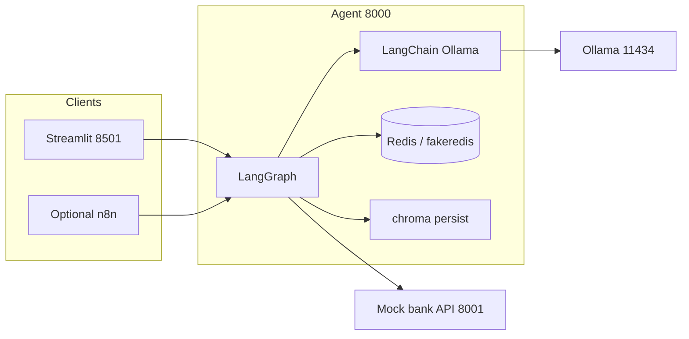

# AI-Powered Personal Finance Assistant — Project Overview

This document summarizes what the demo does, how the pieces fit together, and what each major technology is responsible for.

---

## 1. Project summary

The **Finance Assistant** is a **locally runnable** proof of concept that combines:

- A **chat-style UI** (Streamlit),
- A **backend agent** exposed as REST (FastAPI + **LangGraph**),
- **Mock banking data** (FastAPI + SQLite / JSON seeds),
- A local **large language model** and **embedding model** via **Ollama** (**LangChain** bindings),
- **Retrieval-Augmented Generation (RAG)** over a small Markdown knowledge base (**Chroma**),
- Short-term **conversation memory** (**Redis** or in-process fakeredis).

**Important:** Production banking is **not** connected. Transactions come from seeded **mock data** (`user_001`) so you can test flows without real accounts.

Primary entry point: `python run_local.py` from the `finance-assistant/` directory (optionally `--skip-ingest`, `--no-ui`).

---

## 2. What the system does (end-to-end)

1. The user types a question in **Streamlit** (or calls the **Agent API** / optional **n8n** webhook).
2. The **Agent** runs a **LangGraph** workflow: classify intent → fetch or retrieve context → compute structured insights → generate a natural-language reply.
3. For **money-in-the-ledger** questions, the agent calls the **mock banking API** (`/transactions`), then aggregates totals, categories, and (where relevant) calendar week comparisons.
4. For **educational budgeting / finance** questions routed as advice, it may retrieve **chunks** from **Chroma** (RAG) and pass them into the reply.
5. Replies honor **insights JSON** when present (so aggregates are grounded in fetched rows), with defensive handling when APIs fail or return no rows.

---

## 3. Repository layout (main areas)

| Path | Role |
|------|------|
| `run_local.py` | Orchestrator: `.env`, optional Chroma ingest, starts mock-api, agent, Streamlit; Windows port hygiene. |
| `services/agent/` | LangGraph pipeline, FastAPI `/chat`, RAG ingestion/retrieval, Redis memory, Ollama via LangChain. |
| `services/mock-api/` | FastAPI “bank”: SQLite + seeded transactions, filtering, summaries. |
| `services/frontend/` | Streamlit app: chat UI, sessions, POST to agent. |
| `services/n8n/workflows/` | Optional workflow: webhook routes to `/chat` with `route_hint`. |
| `local_data/` | Default persisted Chroma database (embedded). Created at runtime when using persist mode. |

---

## 4. Components in detail

### 4.1 Streamlit (`services/frontend/app.py`)

- **Purpose:** User-facing chat.
- **Behavior:** Sends `POST /chat` with `message`, `session_id`, and `user_id` (editable in the sidebar; usually `user_001` for mocks).
- **Configuration:** Loads `.env` from `finance-assistant/`; resolves `AGENT_API_URL` so Docker hostname `agent` becomes `127.0.0.1:8000` when running locally.
- **Relationship:** Depends on the Agent API being up.

### 4.2 Agent API — FastAPI (`services/agent/agent_app.py`)

- **Purpose:** Single HTTP surface that runs the LangGraph graph.
- **Key routes:**  
  - `POST /chat` — main turn; merges Redis history into state, invokes graph, stores turn in memory.  
  - History endpoints for snapshots / clears.  
  - `/health`.
- **`local_env`:** Rewrites Compose-style hostnames in env (`mock-api`, `ollama`, `redis`) to `127.0.0.1` for bare-metal runs.
- **`run_server.py`:** In-process `uvicorn` on port **8000** (avoids Windows import path issues).

### 4.3 LangGraph (`services/agent/graph/`)

**LangGraph** models the agent as a **state machine** (graph of nodes) over a shared `AgentState` (messages, user/session ids, intent, transaction payload, insights, RAG snippets, final text).

**Flow (simplified):**

```
intent_router
    ├─ transaction_query / insight_request → transactions_node → insights_node → response_node → END
    ├─ financial_advice → rag_node → response_node → END
    └─ general → response_node → END
```

| Node | Responsibility |
|------|----------------|
| **`intent_router`** | Uses **ChatOllama** (LangChain) to label intent; heuristic fallbacks/heuristic upgrades avoid always landing on `general` when ledger language is obvious. |
| **`transactions_node`** | Calls **`BANKING_API_URL`/transactions** with JSON filters extracted by LLM + phrase fallbacks (e.g. week ranges, widening on empty hits, default lookback window for insight/txn intents). |
| **`insights_node`** | Pure Python aggregation on fetched transactions: totals, by category, averages, calendar week splits (`calendar_week_comparison`), etc. |
| **`rag_node`** | Embedding query → Chroma similarity search → top-k snippets attached to state. |
| **`response_node`** | Final **ChatOllama** synthesis using intent, truncated transaction preview (for illustration only), **INSIGHT JSON**, RAG lines, Redis transcript; safeguards when API/errors/empty dataset. |

**Why LangChain + LangGraph together?** LangChain supplies **promptable LLM/embeddings wrappers** consistent with ecosystem tooling; LangGraph supplies **routing, state, and multi-step pipelines** clearer than one flat chain for this demo.

### 4.4 LangChain (within the agent)

**Used for:**

- **`ChatOllama`** — chat model (default `llama3.2`) for intent, parameter extraction, and final answer.
- **`OllamaEmbeddings`** — embedding model (default `nomic-embed-text`) for RAG query and ingest.
- **Message types** — `HumanMessage` / `AIMessage` in graph state and history replay.

**Not the whole app:** Business rules (aggregation, HTTP to mock bank, Chroma I/O) are ordinary Python.

### 4.5 Ollama

- **Role:** Local inference server for **LLM** and **embeddings** (no cloud API key required for the default path).
- **Config:** `.env` → `OLLAMA_BASE_URL`, `OLLAMA_MODEL`, `OLLAMA_EMBED_MODEL`.
- **Operational note:** If Ollama is down, the graph uses **controlled fallbacks** (heuristics, structured summaries without chat polish) depending on node; unreliable answers without data are discouraged in prompts.

### 4.6 Mock banking API (`services/mock-api/`)

- **Purpose:** Simulate a bank ledger for development.
- **Stack:** FastAPI + SQLAlchemy + SQLite under `services/mock-api/data/`, seeded from `mock_transactions.json` (single demo user **`user_001`**).
- **Endpoints:** Listing transactions with filters (`user_id`, `start_date`, `end_date`, `category`, `limit`), transaction detail, optional summary helpers.
- **`run_server.py`:** In-process uvicorn on **8001**.
- **`BANKING_API_URL`:** Typically `http://127.0.0.1:8001`; must match wherever the mock service listens.

### 4.7 Chroma (RAG vector store)

- **Purpose:** Stores **chunks** of Markdown docs (`services/agent/rag/documents/*.md`), retrieved by semantic similarity.
- **Modes (via `.env`):**  
  - **Default:** `CHROMA_MODE=persist` — embedded **SQLite-backed** persistence under **`local_data/chroma/`** (no separate Chroma server).  
  - **Optional:** `CHROMA_MODE=http` — client talks to a remote Chroma host/port.
- **Ingest:** `rag/ingest.py` — loads `.md`, splits text, embeds with Ollama, writes collection `CHROMA_COLLECTION` (e.g. `finance_knowledge`). Invoked from `run_local.py` unless `--skip-ingest`.
- **Retrieval:** `rag/retriever.py` — query embedding + `collection.query` → snippets for `rag_node`.
- **When RAG runs:** Only when intent is **`financial_advice`** (graph routes to `rag_node`). Transaction/insight paths do not require RAG for numeric answers.

### 4.8 Redis / memory (`services/agent/memory/redis_memory.py`)

- **Purpose:** Per-`session_id` chat history (last turns) so the agent can see recent context on the next message.
- **Default demo:** `REDIS_USE_FAKEREDIS=true` — **in-process** fake Redis; no daemon install.
- **Production-style:** `REDIS_USE_FAKEREDIS=false` + `REDIS_URL` pointing at real Redis.
- **Usage:** Read at start of `/chat`, written after each completed reply.

### 4.9 RAG corpus (static knowledge)

- **Location:** `services/agent/rag/documents/` (e.g. budgeting, saving, financial literacy topics).
- **Role:** Grounding for **educational** answers, not for user-specific balances (those always come from mock API + insights).

### 4.10 Optional n8n (`services/n8n/workflows/finance_workflow.json`)

- **Not started by `run_local.py`.**
- **Pattern:** External clients hit an n8n **Webhook**; workflow classifies a simple “advice vs data” flag and **POSTs** to `http://127.0.0.1:8000/chat` with optional `route_hint`.
- **No LLM inside this sample workflow** — n8n is orchestration only; the **Finance agent** still performs intelligence.

### 4.11 Configuration (`.env` / `.env.example`)

Typical variables include: Ollama URLs/models, Chroma mode/paths/collection, Redis URL + fakeredis flag, `BANKING_API_URL`, `AGENT_API_URL`, `DEFAULT_USER_ID`, `LOG_LEVEL`, optional n8n auth placeholders. See `.env.example` for the template.

---

## 5. Data flow diagram (logical)



---

## 6. Technology cheat sheet

| Piece | Type | What it does here |
|--------|------|---------------------|
| **Python** | Language | Implement services, agent, mocks, ingest. |
| **FastAPI** | Web framework | Agent + mock banking HTTP APIs. |
| **LangGraph** | Agent orchestration | Intent → tools/data steps → reply. |
| **LangChain** | LLM/embedding wrappers | ChatOllama, OllamaEmbeddings. |
| **Ollama** | Local inference | LLM + embedder binaries. |
| **Chroma** | Vector DB | Persisted RAG store (default embedded). |
| **Redis / fakeredis** | Memory store | Short chat history per session. |
| **Streamlit** | UI | Interactive chat frontend. |
| **httpx** | HTTP client | Agent → mock bank from `transactions_node`. |
| **SQLAlchemy / SQLite** | Persistence | Mock bank transaction storage. |
| **dotenv** | Config | `.env` loading across services. |
| **n8n** (optional) | Automation | Routes webhooks into `/chat`. |

---

## 7. Operational tips

1. Start with **`python run_local.py`**; confirm **mock 8001** and **agent 8000** both listen (avoid port conflicts).
2. Use **`DEFAULT_USER_ID` / sidebar User ID** matching seeded data (**`user_001`** unless you extend seeds).
3. Ensure **Ollama** has **`llama3.2`** and **`nomic-embed-text`** pulled if ingest/RAG/embeddings matter.
4. After changing RAG Markdown, run ingest (full `run_local` without `--skip-ingest`, or your ingest command).
5. For architecture at a glance, see also `README.md` in this folder.

---

## 8. Out of scope / limitations (by design)

- No real PSD2/Open Banking, no authenticated production bank connectors.
- Mock dataset size and shape are finite; aggregates are **only as good as the fetched slice**.
- Local LLMs can still misphrase; prompting and JSON-first insights are meant to reduce numeric hallucinations, not eliminate all model quirks.

---

*This overview reflects the codebase layout and behavior as of the current repository; filenames and behaviors may evolve—when in doubt, follow `README.md` and inspect `services/agent/graph/agent_graph.py` for the authoritative graph.*
