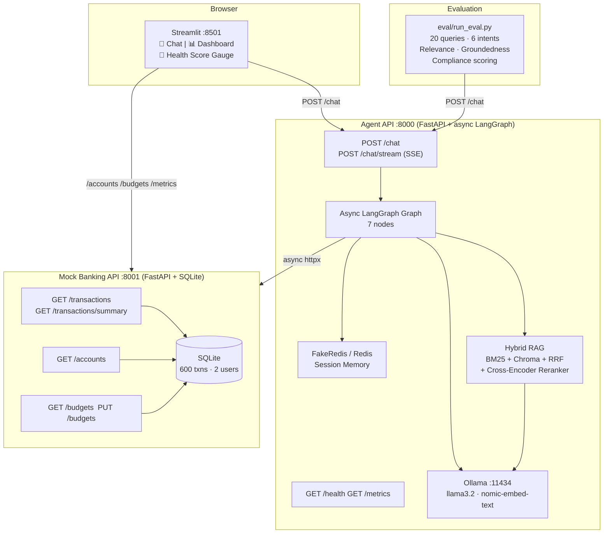
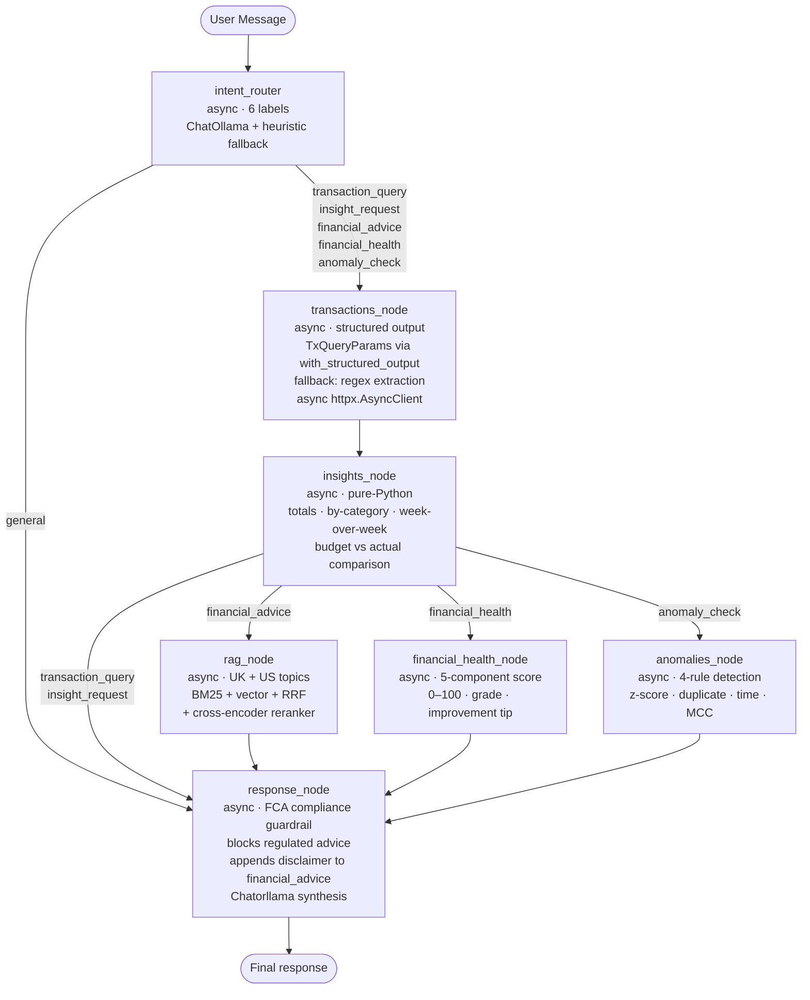
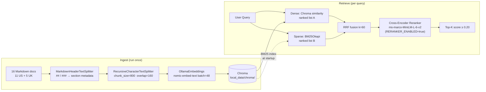

# AI-Powered Personal Finance Assistant

A **locally runnable** AI finance assistant — Streamlit chat + live dashboard, async LangGraph agent with 7 nodes, hybrid RAG (BM25 + Chroma + RRF + cross-encoder reranker), financial health scoring, anomaly detection, FCA compliance guardrail, UK fintech knowledge base, SSE streaming, and end-to-end evaluation framework. No Docker, no cloud API key required.

Full architecture → **`PROJECT_OVERVIEW.md`** · Audit trail → **`BACKEND_AUDIT_ROADMAP.md`** · Diagrams → **`ARCHITECTURE_DIAGRAMS.md`**

---

## System Architecture



---

## LangGraph Agent Flow (7 nodes, all async)



---

## Hybrid RAG Pipeline with Reranker



---

## Prerequisites

- Python **3.11–3.13**
- [Ollama](https://ollama.com) running locally

```bash
ollama pull llama3.2
ollama pull nomic-embed-text
```

Optional — cross-encoder reranker (~80 MB download on first run):
```bash
pip install sentence-transformers
```

---

## Setup and run

```bash
cd "finance-assistant/"

python -m venv .venv
source .venv/Scripts/activate      # Git Bash on Windows
pip install --upgrade pip
pip install -r requirements-local.txt

python run_local.py
```

| Flag | Effect |
|---|---|
| `--skip-ingest` | Reuse existing Chroma index (fast restart) |
| `--no-ui` | APIs only, no Streamlit |
| `--free-ports` | Windows: kill stale processes on 8000/8001/8501 |

Stop with **Ctrl+C**.

---

## URLs

| Service | URL |
|---|---|
| Streamlit — Chat + Dashboard | http://127.0.0.1:8501 |
| Agent API docs | http://127.0.0.1:8000/docs |
| Mock Banking API docs | http://127.0.0.1:8001/docs |
| Agent Prometheus metrics | http://127.0.0.1:8000/metrics |
| Mock API Prometheus metrics | http://127.0.0.1:8001/metrics |

---

## Example questions

**Transactions & Insights**
- "List my recent spending"
- "What did I spend on food this month?"
- "Compare my spending this week vs last week"
- "Which category am I overspending in?"

**Financial Health Score**
- "What is my overall financial health score?"
- "Am I on track financially? What should I improve?"
- "Give me a full financial situation assessment"

**Anomaly Detection**
- "Are there any suspicious transactions?"
- "Show me unusual activity in my account"
- "Have I been charged twice for anything?"

**Financial Advice (triggers RAG · UK knowledge base)**
- "How much should I have in my emergency fund?"
- "Explain the UK ISA allowance — which type should I use?"
- "How does salary sacrifice work for pension contributions?"
- "What is the 50/30/20 rule?"
- "How do UK credit scores work?"

---

## Running the evaluation suite

```bash
# Requires the full stack to be running
python eval/run_eval.py

# Or target a specific user / server
python eval/run_eval.py --url http://127.0.0.1:8000 --user-id user_001
```

Outputs a summary table to stdout and saves `eval/results/eval_YYYY-MM-DD.json`.

---

## Running the tests

```bash
cd services/agent
pytest tests/ -v
```

Includes `tests/test_bug_fixes.py` — 59 regression tests covering all 7 Bug Fix Round 2 items.

---

## Engineering quality — Bug Fix Round 2 (June 2026)

Seven confirmed engineering bugs were found through 20-query live system testing and fixed:

| # | Symptom | Root cause fixed |
|---|---|---|
| 1 | Different queries returned identical responses | Added `_assert_clean_state()` guard before every `ainvoke`; defensive history copy |
| 2 | LLM replied "you didn't ask a specific question" | Restructured `human_payload`: question first, JSON context after, directive last |
| 3 | "Cash ISA vs S&S ISA" routed to `transaction_query` | Strong-signal keyword override (`_apply_strong_overrides`) fires regardless of LLM label |
| 4 | Financial health score changed between identical calls | `anchor_date` pinned once at node entry; 90-day income fallback; per-session cache |
| 5 | Anomaly detection returned "no suspicious transactions" | Leave-one-out z-score; 4 synthetic anomalies injected into seed; `anomaly_check` now fetches 250 transactions |
| 6 | "Which stocks would you recommend" bypassed guardrail | 11 new FCA regex patterns; guardrail returns fixed message with zero LLM calls |
| 7 | Gibberish input returned detailed financial advice | Gibberish/low-signal check before LLM; `unclear_intent` route with constrained one-sentence clarifier |

---

## Resetting local data

```bash
rm -rf services/mock-api/data/    # SQLite DB
rm -rf local_data/chroma/          # Vector database
python run_local.py                # Rebuilds from scratch
```
