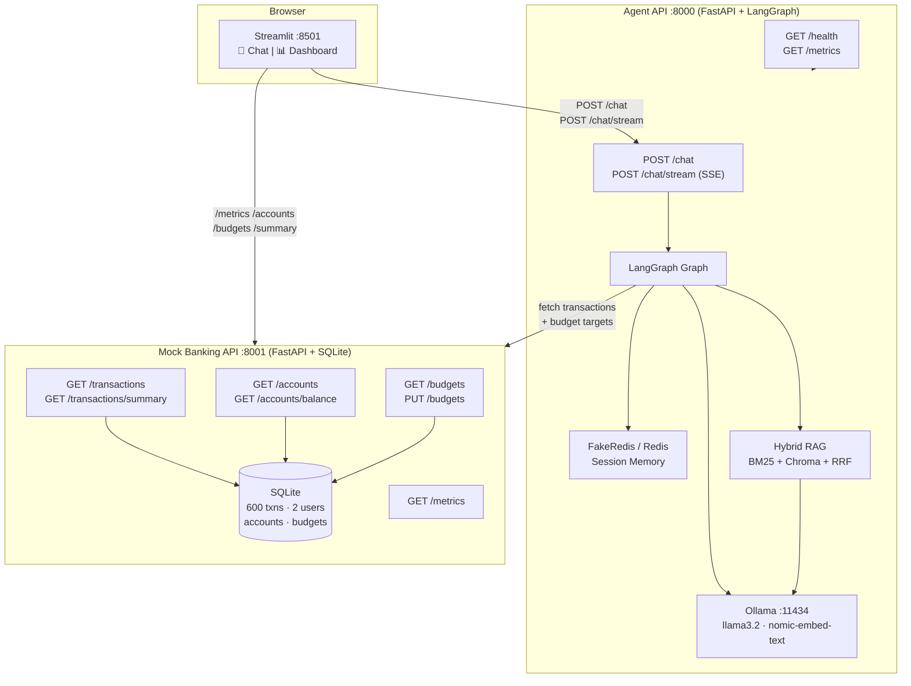
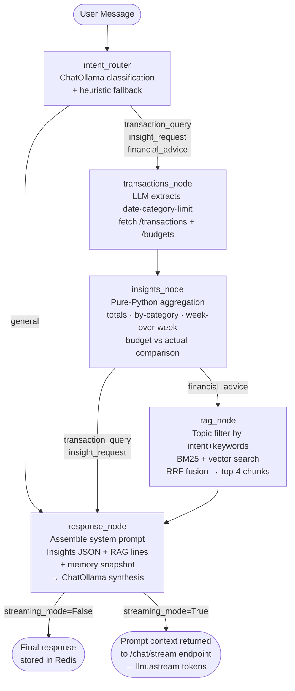
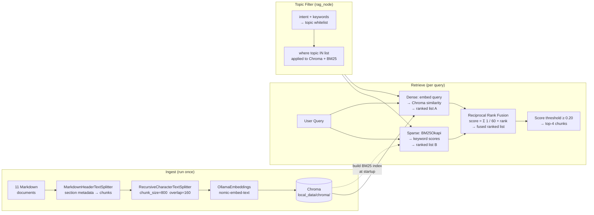

# AI-Powered Personal Finance Assistant

A **locally runnable** AI finance assistant — Streamlit chat + live dashboard, LangGraph agent, hybrid RAG (BM25 + vector + RRF), SSE streaming, budget tracking, and Prometheus observability. No Docker, no cloud API key required.

Full architecture → **`PROJECT_OVERVIEW.md`** · Audit trail → **`BACKEND_AUDIT_ROADMAP.md`**

---

## System Architecture



---

## LangGraph Agent Flow



---

## RAG Pipeline



---

## Prerequisites

- Python **3.11–3.13**
- [Ollama](https://ollama.com) running locally

```bash
ollama pull llama3.2
ollama pull nomic-embed-text
```

---

## Setup and run

```bash
cd "finance-assistant/"

python -m venv .venv
source .venv/Scripts/activate      # Git Bash on Windows
pip install --upgrade pip
pip install -r requirements-local.txt

python run_local.py
```

| Flag | Effect |
|---|---|
| `--skip-ingest` | Reuse existing Chroma index (fast restart) |
| `--no-ui` | APIs only, no Streamlit |
| `--free-ports` | Windows: kill stale processes on 8000/8001/8501 |

Stop with **Ctrl+C**.

---

## URLs

| Service | URL |
|---|---|
| Streamlit — Chat + Dashboard | http://127.0.0.1:8501 |
| Agent API docs | http://127.0.0.1:8000/docs |
| Mock Banking API docs | http://127.0.0.1:8001/docs |
| Agent Prometheus metrics | http://127.0.0.1:8000/metrics |
| Mock API Prometheus metrics | http://127.0.0.1:8001/metrics |

---

## Example questions

**Transactions / Insights**
- "List my recent spending"
- "What did I spend on food this month?"
- "Compare my spending this week vs last week"
- "Which category am I overspending in?"

**Financial advice (triggers RAG)**
- "How much should I have in my emergency fund?"
- "Explain the 50/30/20 rule with my income in mind"
- "Should I use the debt avalanche or snowball method?"
- "What's the difference between a Roth IRA and a 401k?"
- "How does my spending compare to the average American?"

---

## Resetting local data

```bash
rm -rf services/mock-api/data/    # SQLite DB (transactions, accounts, budgets)
rm -rf local_data/chroma/          # Vector database
python run_local.py                # Rebuilds everything from scratch
```
